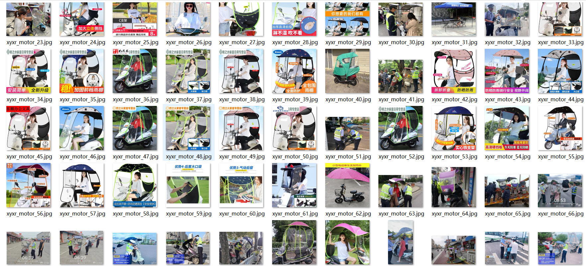
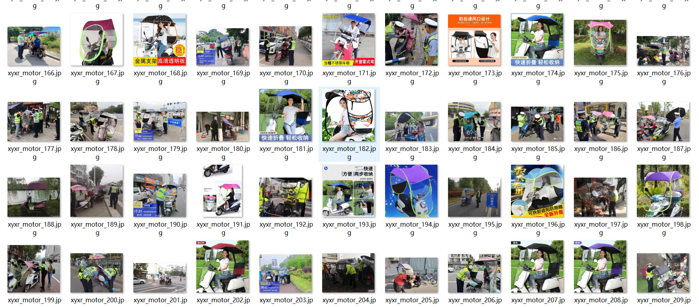

# [Object Detection] Electric Motion Vehicle Motorcycle Illegally fitted awning Dataset 846 imagesVOC+YOLO format

Dataset Description: ~

Dataset format: Pascal VOC format + YOLO format (the txt file does not contain the split path, it only contains jpg images and corresponding VOC format xml files and yolo format txt files)

Number of images (number of jpg files): 846

Number of annotations (number of xml files): 846

Number of annotations (number of txt files): 846

Number of annotated categories: 3

Annotation class names: ["motor","motor-jz","motor-z"]

Number of boxes labeled in each category:

motor frame count = 75

motor-jz frame count = 939

motor-z frame count = 19

Total boxes: 1033

Use the labeling tool: labelImg

Rules for annotation: Draw a rectangle around the category.

plain text chain join ：https://blog.csdn.net/lwx666sl/article/details/141830672

## Images

---

Here is a pay link on Stripe (https://buy.stripe.com/3cs8yP7sY87d0vu9AB). Please contact me lonlonago@foxmail.com after funding $89, and I will send you a complete data files, thank you!

